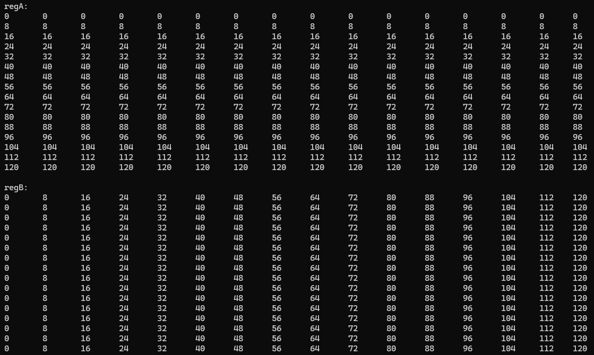
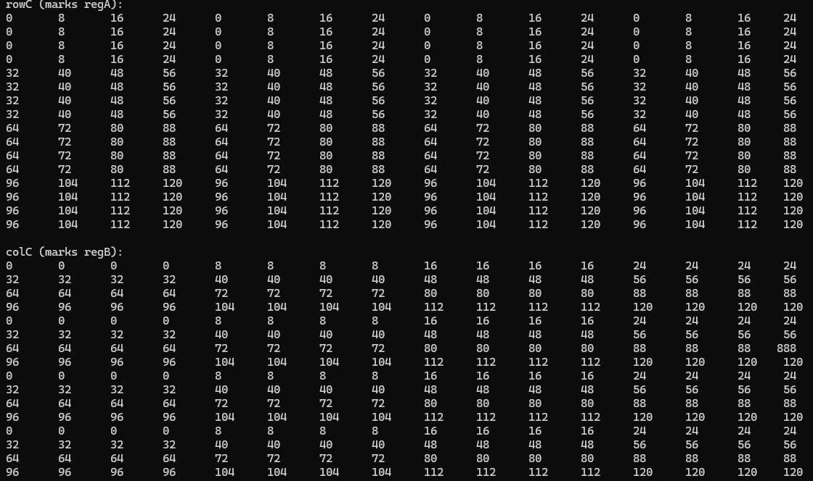

# SGEMM
  GEMM does matrix multiplication, mainly FFMA\(multiple and add\). There are SGEMM(single-precision), HGEMM(half-precision) etc. The algorithm runs on GPU with CUDA or Tensor cores pretty fast. 
  
  This is a project of my road to SGEMM. It uses CUDA core only. 
## What can SGEMM do
  matrix A * matrix B = matrix C. A lot of calculations contains this. I major in communication engineering in the university, convolution can be implemented with matrix multiplicaation(with im2col). It's also used in deep learning, neural networks(I haven't use them yet).
## Platform
  i9-13950HX
  
  RTX3500Ada
  
  64GB DDR5

  AND

  AMD ThreadRipper 3990X

  RTX2070

  128GB DDR4
## Physical limitations
  Chasing the speed of CUBLAS and hardware limitations. 
  - TODO
  CUBLAS will be used in `simpleCUBLAS.cu` for comparision.
    ### Hardware limitations of RTX3500Ada(no boost)
      RTX3500Ada: 5120 CUDA cores + 1545 MHz clock
    
      Single precision floating-point performance = 5120\*2\*1545\*1e6/1e9 = 15.82 TFLOPS

      RTX2070: 2304 CUDA cores + 1620 MHz clock

      Single precision floating-point performance = 2304\*2\*1620\*1e6/1e9 = 7.46 TFLOPS
## Implementation
### Core: How to reach the hardware limitation
  Hiding the latency is important. Threads can't just wait for data, they should always be computing.
- From gmem to smem

  For my gpu, the ratio of computing and data loading is 15.82T/432G = 36.6(without L2 cache hit).
  
  For algorithm, the ratio is defined as dataComputes/dataLoads.
  
  If Ralgo>Rgpu, the gmem is no longer a problem.

  Hint: Matrix multiplication is A's row * B's col, so when you store one block into smem, L2 cache will probably be hit when you read the next time. Hit ratio arises especially for matrix A, because the same row reads the same block.
- From smem to reg

  Smem is fast enough. Why still register is needed? Due to [CUDA C Programming Guide](https://docs.nvidia.com/cuda/cuda-c-programming-guide/index.html#shared-memory)\(CUDA 12.4, Chapter3.2.4\), The matrix multiplication is performed by smem directly. In smem, matrix A is read by row, but matrix B is read by col. Though here are no bank conflicts, each time only one element needed in matrix B, which results waste of other 31 bytes. So even smem is running with full bandwidth, matrix B still wastes a lot of bandwidth.

  So based on the reference\(end of the current doc\), we need to consider latency here. Assuming that it's fully running with pipeline\(hide the latency of smem\). Each cycle the smem pops data out\(might be 128 bytes, depends on your gpu\), the CUDA core computes. But a lot of data is wasted, the CUDA core could perform 128\(still depends on your gpu\) FFMA ops, now it can only perform several. So read by row in smem is bad, we need registers.
### How we consider optimizing
  Use faster memory. Hide latency. Keep computing.

  Gmem -> smem, we consider bandwidth.Smem->register, we consider ratio of computing/dataloading.
### About the code
#### smem_gemm
&ensp;&ensp;When we perform FFMA in register level, we read matA by column, matB by row. So before we compute, a transpose is needed in gmem->smem decade. We transpose matA there using registers. Then for each K_tile we read matA and matB by row with 128bit vector request. FFMA will be performed in the K-M-N loop, regC will be updated too. After that, sync to make sure all the data is well stored in regC per thread. Last step, store every 8x8 result into gmem. 

&ensp;&ensp;Here our threads work like this:

\(Picture here\)

They read by order, store by order. Every time matA is read, they broadcast, because the same row\(threadIdx.y\) reads the same matA address. Every time matB is read, they seldom broadcast, because the same threadIdx.x reads the same matB address. It will be explained in the following paragraph.

&ensp;&ensp;Explaining here about bank conflict and broadcast. It's advised to read this with the corresponding code. Float4 equals to 128bit, a warp will be seperated into 4 times if it performs 128bit request to smem, 8 threads each time\(If 32bit, int or float, 32 threads read smem at once\). So gmem->smem, transposing matA, thread0 and thread1\(odd and even\) has the same rowA, and M_tile=128 can be divided by 32, bank conflict happens here between thread0 and thread1 4 times. Same in smem->reg, matA is read by threadIdx.y, broadcast, no conflict, matB is read by threadIdx.x\(exactly threadIdx.x*8\), 32/8=4, so every 4 thread conflicts, for example thread0 and thread4 read float4 from the same 4 smem bank, they conflict. Bank conflict influense performance here. 

&ensp;&ensp;So every warp size 2x16, reads `(2*K + 16*K)*4`, computes `2*16*K*2`, ratio of compute/ld = 16/18. What if we tile the warp by size 4x8? It reads `(4*K + 8*K)*4`, computes `4*8*K*2`, ratio of compute/ld = 16/12. Higher ratio than before! warp_tile_gemm will do this.
#### warp_tile_gemm
&ensp;&ensp;Bank conflict is not processed here. We just tile warps here. But we cannot really make 4x8 warps, since our blockSize is 16x16, the warp is set by 2x16. So we change indices to achieve warp tiling. First we have to know what indices should be changed. It's the indices that have something to do with the warps. So reading matA and matB into regA and regB, storing regC into gmem need to be changed. In total: address of reading matA, matB, and baseC. 
&ensp;&ensp;How to change indices? We use rowC, colC to replace threadIdx.y\*M_num, threadIdx.x\*N_num. So simply replace the code. The point is how to write rowC and colC. The first thing I thought is each threads needs 2 float4 for every matrix, so here must be 8\*something. Let's see how the original one works: 

The image shows what data should every thread read from smem, the number means the offset address of current K_tile loop. As we can see, row by row, col by col, every multiplication is unique. So all we need to do is tile the data by 4x8, and make sure that every multiplication is unique. Design rowC and colC symmetrically, 4 rows contains 2 warps, so warpId should be divided by 2\(for 4 rows\), each warp contains 32 threads, so warpbId should be divided by 4\(for 8 columns\). Put them together, we get rowC and colC in the code. The tiled one works like this:

ColC is divided into 4x8 perfectly, but rowC is 4x4 for unique mulitiplications.
#### fixed_smem_gemm
&ensp;&ensp;warp_tile_gemm.cu does run a little bit faster than smem_gemm.cu, and due to the tiling, reading matB now has no bank conflict, though transposing matA still has bank conflict. But it should not be just a little bit faster\(+6~7%\). I checked Nsight compute to find that the code has a register overflow problem.

&ensp;&ensp;Reg of smem_gemm:

&ensp;&ensp;RTX2070 = 113, RTX3500Ada = 127

&ensp;&ensp;Reg of warp_tile_gemm:

&ensp;&ensp;RTX2070 = 90, RTX3500Ada = 90

&ensp;&ensp;warp_tile_gemm has more variables than smem_gemm, so both of Turing and Ada overflows registers.

&ensp;&ensp;This file tends to reduce the use of registers. Here are several methods to reduce registers: use PTX, reduce variables, wait for new cards. Before I search the fourm, I created this file with all variables fixed. But no registers are reduced. Because the counts of registers are optimized by the complier, so simply fix all the variables or delete several variables may not reduce the use of registers. So this file has been deprecated. I will find some way else to solve this.

#### warp_op_noconflict
&ensp;&ensp;Based on warp_tile_gemm, solving matA's bank conflict. Simply pad the memory of matA. No bank conflict checked by Nsight compute. Performance improved a little due to register overflow.

#### db_gemm
&ensp;&ensp;FFMA can run with ld/st unit at the same time, so when the current K_tile is computing, load the next tile. Double buffer does this. In prefetching, ada can read data directly from gmem to smem without the assistance of register, but turing still needs additional registers. 

### Todo
Register overflow

Baseclock frequency drop

SplitK

## Reference
  [YHs_Sample](https://github.com/Yinghan-Li/YHs_Sample/tree/master)
